# Bicep
Infrastructure as a code for Azure

2026-01-24 i spent time following azure learning paths and creating infrastructure in Azure. Once i was done i exported the file as bicep instead of `JSON`. It was a mistake as the instruction to import a bicep file failed.

```powershell
az deployment group create --resource-group rg-research-dev --template-file .\main.bicep
```

the diagram in mermaid for the file is as below
- [azure icons](https://mermaid.ai/docs/icons/azure)
- [nice online viewer](https://www.mermaidflow.app/editor)

## mermaid Architecture diagram

```mermaid
architecture-beta
    %% Group: Monitoring & Logging
    group monitoring(logos:azure)[Azure Monitor Logging]
    service logAnalytic(logos:azure:log-analytics-workspaces)[Log Analytics Workspace] in monitoring
    service dataCollect(logos:azure)[Data Collection Endpoint] in monitoring
    service appInsight(azure:application-insights)[Application Insights] in monitoring
    service actionGroup(azure:application-group)[Action Group] in monitoring

    %% Group: Compute Resources
    group compute(server)[Compute Resources]
    service VM1(logos:microsoft-windows)[Windows VM] in compute
    service VM2(logos:linux-tux)[Linux VM] in compute
    service EXT(logos:azure)[VM Extension] in compute

    %% Group: Network Resources
    group network(cloud)[Network Resources]
    service VNet1(logos:azure)[VNet East US] in network
    service VNet2(logos:azure)[VNet East US 1] in network
    service NSG1(logos:azure)[NSG Windows] in network
    service NSG2(logos:azure)[NSG Linux] in network
    service PIP1(logos:azure)[Public IP Windows] in network
    service PIP2(logos:azure)[Public IP Linux] in network

    %% Group: Web & Database
    group appservices(logos:azure)[Web and Database]
      service AP1(logos:azure)[App Service Plan 1] in appservices
      service AP2(logos:azure)[App Service Plan 2] in appservices
      service WEB1(logos:azure)[Web App 1] in appservices
      service WEB2(logos:azure)[Web App 2] in appservices
      service SQL(logos:azure-sql-database)[SQL Server] in appservices

    %% Group: Alerting
    group alerting(logos:azure)[Alert Management]
      service SDA(logos:azure)[Smart Detector] in alerting
      service MA(logos:azure)[Metric Alert] in alerting
      service PP(logos:azure:process-explorer)[Metric Polling process] in alerting

    %% Relationships
    %% Network & Compute
    NSG1:R -- L:VM1
    NSG2:R -- L:VM2
    PIP1:R -- L:VM1
    PIP2:R -- L:VM2
    EXT:R -- L:VM2

    %% Logging Connections
    VM1:T -- B:logAnalytic
    VM2:T -- B:logAnalytic
    SQL:R -- L:logAnalytic
    dataCollect:R -- L:logAnalytic
    appInsight:R -- L:logAnalytic

    %% Web & App Connections
    WEB1:B -- T:AP1
    WEB2:B -- T:AP2
    WEB2:R -- L:appInsight

    %% Alerting Connections
    MA:L -- R:actionGroup
```


## mermaid Graph diagram

```mermaid
graph TB
    subgraph Monitoring["Azure Monitor & Logging"]
        LA["Log Analytics Workspace<br/>LogAnalytics1"]
        DCE["Data Collection Endpoint<br/>IaaSVMCollectionEndpoint"]
        AI["Application Insights<br/>AzureLinuxAppZZ777"]
        AG["Action Group<br/>NotifyCPU"]
    end
    
    subgraph Compute["Compute Resources"]
        VM1["Windows VM<br/>WS_VM1"]
        VM2["Linux VM<br/>Linux_VM2"]
        EXT["VM Extension<br/>NetworkWatcher"]
    end
    
    subgraph Network["Network Resources"]
        VNet1["Virtual Network<br/>vnet_eastus"]
        VNet2["Virtual Network<br/>vnet_eastus_1"]
        NSG1["Network Security Group<br/>WS_VM1_nsg"]
        NSG2["Network Security Group<br/>Linux_VM2_nsg"]
        PIP1["Public IP<br/>WS_VM1_ip"]
        PIP2["Public IP<br/>Linux_VM2_ip"]
    end
    
    subgraph AppServices["Web & Database"]
        AP1["App Service Plan<br/>hostingplanq7efyqm4edbxa"]
        AP2["App Service Plan<br/>AppServicePlan_AzureLinuxAppZZ777"]
        WEB1["Web App"]
        WEB2["Web App<br/>AzureLinuxAppZZ777"]
        SQL["SQL Server<br/>sqlserverq7efyqm4edbxa"]
    end
    
    subgraph Alerting["Alert Management"]
        SDA["Smart Detector Alert Rule<br/>failure_anomalies"]
        MA["Metric Alert<br/>HighCPU"]
    end
    
    VM1 --> NSG1
    VM2 --> NSG2
    VM1 --> PIP1
    VM2 --> PIP2
    NSG1 --> VNet1
    NSG2 --> VNet2
    VM1 --> LA
    VM2 --> LA
    EXT --> VM2
    WEB2 --> AP2
    WEB1 --> AP1
    SQL --> LA
    AI --> LA
    DCE --> LA
    SDA --> AG
    MA --> AG
    WEB2 --> AI
    
    style LA fill:#0078d4,stroke:#005a9e,stroke-width:2px,color:#fff
    style DCE fill:#0078d4,stroke:#005a9e,stroke-width:2px,color:#fff
    style AI fill:#0078d4,stroke:#005a9e,stroke-width:2px,color:#fff
    style AG fill:#0078d4,stroke:#005a9e,stroke-width:2px,color:#fff
    style VM1 fill:#50e6ff,stroke:#0078d4,stroke-width:2px,color:#000
    style VM2 fill:#50e6ff,stroke:#0078d4,stroke-width:2px,color:#000
    style VNet1 fill:#7fba00,stroke:#5a9900,stroke-width:2px,color:#fff
    style VNet2 fill:#7fba00,stroke:#5a9900,stroke-width:2px,color:#fff
    style SQL fill:#f7a100,stroke:#c5a900,stroke-width:2px,color:#000
    style WEB1 fill:#00b4ef,stroke:#0078d4,stroke-width:2px,color:#fff
    style WEB2 fill:#00b4ef,stroke:#0078d4,stroke-width:2px,color:#fff
```
